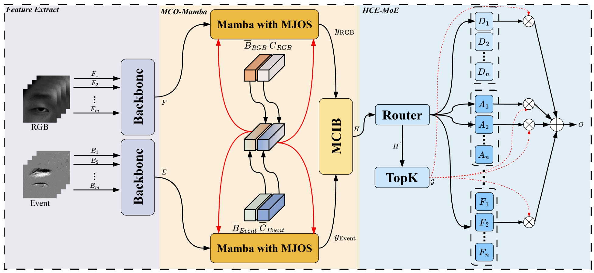

<div align="center">
<h1>Multi-modal Collaborative Optimization and Expansion Network for Event-assisted Single-eye Expression Recognition</h1>

Runduo Han, Xiuping Liu, Shangxuan Yi, Yi Zhang, Hongchen Tan


</div>

## Abstract
In this paper,  we  proposed  a Multi-modal Collaborative Optimization and Expansion Network (MCO-E Net),  to use event modalities to resist challenges such as low light, high exposure, and high dynamic range in single-eye expression recognition tasks. The MCO-E Net introduces two innovative designs: Multi-modal Collaborative Optimization Mamba (MCO-Mamba) and Heterogeneous Collaborative and Expansion Mixture-of-Experts (HCE-MoE). MCO-Mamba, building upon Mamba, leverages dual-modal information to jointly optimize the model, facilitating collaborative interaction and fusion of modal semantics. This approach encourages the model to balance the learning of both modalities and harness their respective strengths. HCE-MoE, on the other hand, employs a dynamic routing mechanism to distribute structurally varied experts (deep, attention, and focal), fostering collaborative learning of complementary semantics. This heterogeneous architecture systematically integrates diverse feature extraction paradigms to comprehensively capture expression semantics.

## Overview
<div align="center">

</div>


## Datasets
Apply for [SEE](https://github.com/zhanghaiwei1234/Single-eye-Emotion-Recognition) dataset. 

Modify the dataset path in the `opt.py` file: `"--event_video_path"` and `"--frame_video_path`"

## Start

```bash
git clone https://github.com/hrdhrd/MCO-E-Net
cd MCO-E-Net
unzip code.zip
```

## Train
To train the model, *first*:

```bash
pip install -r requirements.txt
mkdir your_save_path
cd code
```
*Then*, replace the code in `./mamba_ssm/ops/selective_scan_interface.py` with the code in `BC.py`

*final*,
```bash
CUDA_VISIBLE_DEVICES=0  python train.py   --result_path  your_save_path   --inference  --tensorboard --sample_duration 4    --sample_t_stride 4  --inference_sample_duration 4
```
## Evaluation
To evaluate the model, run:
```bash
CUDA_VISIBLE_DEVICES=0  python evaluation.py   --result_path  your_save_path   --inference  --tensorboard --sample_duration 4    --sample_t_stride 4  --inference_sample_duration 4 
```
## Accuracy
Calculate UAR, WAR: 
```bash
python read_20json_result.py
```


## Acknowledgement
This project is based on Mamba ([paper](https://arxiv.org/abs/2312.00752), [code](https://github.com/state-spaces/mamba)), SEEN ([paper](https://arxiv.org/abs/2310.04043), [code](https://github.com/zhanghaiwei1234/Single-eye-Emotion-Recognition)). Thanks for their wonderful works.

